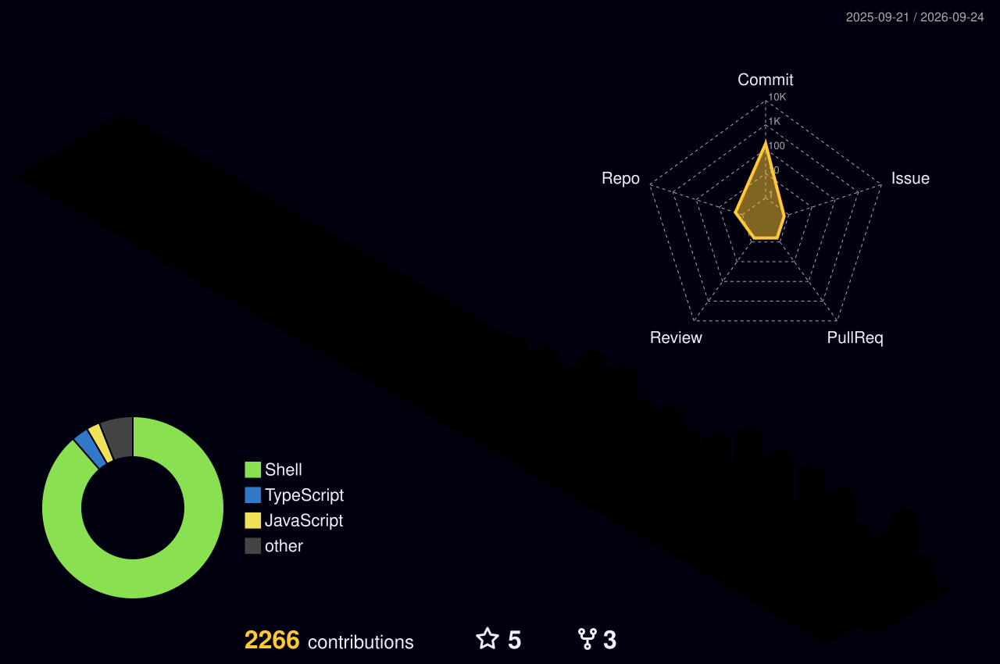

  
  
  
  

 

## 🩸 What I'm building

**[Vyana](https://vyanaapp.com)** is a private period tracker built for real cycles, not textbook ones.
Irregular cycles first. Honest predictions with confidence bands instead of fake certainty. A report your doctor can actually read.

I own every layer solo:

| Layer | What | Stack |
|---|---|---|
| 📱 App | iOS + Android, OTA updates | React Native, Expo, TypeScript |
| ⚙️ Backend | 8 replica API, cycle engine, insights | Node, TypeScript, Prisma, Postgres |
| 🧠 AI | Streaming chat over your own cycle data | Claude, SSE, guarded prompts |
| 🚀 Ops | Staging first, gated ship pipeline | Railway, Supabase, EAS, Sentry |

 

## 🔥 Open source

<table>
<tr>
<td width="50%" valign="top">

### [heatwave](https://github.com/abhirajsinha/heatwave)
A verification protocol for AI written code.
**Plan → build → review → prove**, in a loop that never silently restarts.
Separate planner, implementer and reviewer contexts. Evidence over assertion.
Works with Claude Code, Codex, Gemini CLI, Cursor, any agent.

`shell` `protocol` `agents` `zero deps`

</td>
<td width="50%" valign="top">

### [omoi-sms-parser](https://github.com/abhirajsinha/omoi-sms-parser)
On device parser for Indian bank and UPI transaction SMS.
DLT sender ID gate plus a deterministic grammar, so it generalises to banks it has never seen.
Pure TypeScript, zero dependencies.

`typescript` `fintech` `parsing` `india`

</td>
</tr>
</table>

 

## 🧰 Toolbox

 

## 📊 Stats

 

<picture>
  <source media="(prefers-color-scheme: dark)" srcset="https://raw.githubusercontent.com/abhirajsinha/abhirajsinha/output/github-snake-dark.svg" />
  
</picture>

 

## 🧭 How I work

- **Ship one thing, then the next.** Build one, ship one, branch off the released trunk.
- **Evidence, not assertion.** Nothing is "verified" without a method and an artifact. That rule became [heatwave](https://github.com/abhirajsinha/heatwave).
- **Fix the class, not the instance.** If a fix only holds for the bug I saw, it is not a fix.
- **AI agents as teammates, not autocomplete.** Separate planner, implementer, reviewer. Nobody grades their own homework.

 

Hyderabad, India · building in public at <a href="https://vyanaapp.com">vyanaapp.com</a>

